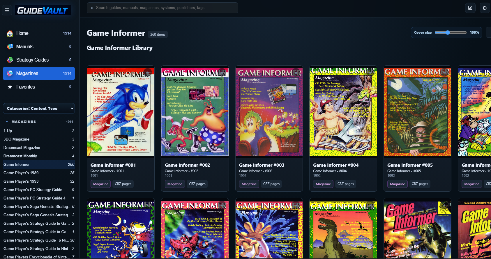

# Guidevault

Self-hosted digital library and web reader for **video game manuals, strategy guides, and gaming magazines**.

Guidevault is built for people who keep local collections of scanned game literature and want a clean browser-based way to organize, browse, read, and preserve them.

## Screenshot



## Current status

Guidevault is currently in active pre-release development.

Current working version: **0.9.58**

The app is usable for local/self-hosted testing, but some advanced admin areas are still being refined.

## Features

- Self-hosted web interface for game literature
- Browser-based reader for manuals, strategy guides, and magazines
- Support for `.cbz`, `.cbr`, and `.pdf` library items
- Local folder scanning without uploading source files into the app
- Manual, strategy guide, and magazine library sections
- Details pages with overview, metadata, and notes
- Editable metadata and library cleanup tools
- Guidevault-native metadata direction with legacy `ComicInfo.xml` import support
- Associated platform metadata for multi-platform strategy guides
- Reader options for single-page, two-page, and adaptive page layouts
- Book-style reader visuals with page transitions, spine/gutter shading, and fullscreen support
- User accounts, profiles, and profile images
- Customizable home shelves and side navigation
- OPDS support for compatible readers
- Server settings for hostname, base URL, port, backups, media paths, email, users, and recurring tasks
- Update history available from the app info area

## Supported content types

Guidevault is focused on video game literature:

- Game manuals
- Strategy guides
- Gaming magazines
- Reference material
- Scanned game inserts, maps, and related reading material

Supported file types:

```text
.cbz
.cbr
.pdf
```

## Suggested library layout

Guidevault can scan any configured folder, but this kind of structure keeps collections easier to manage:

```text
Guidevault Library/
  Manuals/
    Nintendo Entertainment System/
    Super Nintendo Entertainment System/
    Sega Genesis/

  Strategy Guides/
    Nintendo/
    Sega/
    Sony PlayStation/

  Magazines/
    Nintendo Power/
    Electronic Gaming Monthly/
    GamePro/
```

## Quick start with Docker

Create a folder for Guidevault data and point the library mount at your own collection folder.

```yaml
services:
  guidevault:
    image: ghcr.io/shredder5262/guidevault:latest
    container_name: guidevault
    restart: unless-stopped
    ports:
      - "5478:5478"
    environment:
      ASPNETCORE_URLS: "http://+:5478"
      GUIDEVAULT_DATA: "/data"
      GUIDEVAULT_LIBRARY_PATH: "/library"
    volumes:
      - ./guidevault-data:/data
      - D:/GameLibrary/Guides:/library:ro
```

Start the container:

```powershell
docker compose up -d
```

Then open:

```text
http://localhost:5478
```

Guidevault uses port `5478` by default so it can coexist with other self-hosted readers that commonly use port `5000`.

## Local development

From a local checkout:

```powershell
cd <GUIDEVAULT_ROOT>
dotnet restore .\src\Guidevault.Web\Guidevault.Web.csproj
dotnet run --project .\src\Guidevault.Web\Guidevault.Web.csproj
```

Then open the localhost URL shown by `dotnet run`.

If your local checkout still uses the legacy project folder name, run the matching project file from your local source tree instead.

## First run

On first launch, Guidevault creates the initial local user account.

First-run setup asks for:

- Username
- Email address
- Password

After the first account exists, users can sign in with either:

- Username
- Email address

## Library scanning

Guidevault is designed to **scan and index local files**, not upload them into the app.

The original manual, guide, or magazine files remain in the library folder you choose. Guidevault stores its own app data, generated cache, metadata, profile data, and settings separately under its configured data path.

## Metadata

Guidevault supports imported and editable metadata for game literature.

Common metadata fields include:

- Title
- Series
- Preferred platform
- Associated platforms
- Publisher
- Year
- Region
- Language
- Issue number
- Volume / number
- Guide type
- Edition type
- ISBN / ASIN
- Summary
- Tags
- Notes

`ComicInfo.xml` is supported as a legacy import source. The preferred long-term direction is Guidevault-native metadata for game literature.

## Reader

The reader supports several book-focused behaviors:

- Cover-first reading
- Single-page mode
- Two-page spreads
- Adaptive two-page handling
- Fullscreen reading
- Page transitions
- Bookmark support
- Zoom and magnifier controls
- Background and shading preferences
- Per-item and per-series reading profile direction

## OPDS

Guidevault includes OPDS support for compatible reading clients.

OPDS can be enabled or disabled from the server settings area. The local default port is:

```text
http://localhost:5478
```

## Email and users

Guidevault includes early support for:

- User management
- Invite flow scaffolding
- Email templates
- Email history
- Transactional email provider direction
- SMTP fallback for providers that still support app passwords or service credentials

For long-term reliability, a transactional email provider is recommended over a personal mailbox.

## Backups and maintenance

The server settings area includes early options for:

- Library backup paths
- Bookmarks directory
- Logging level
- Recurring task configuration
- Email history review
- Server/network configuration

Backup and maintenance workflows are expected to continue improving as the app moves toward release-candidate status.

## Development notes

Do not commit local runtime data or personal library files.

Keep these out of the repository:

```text
guidevault-data/
data/
cache/
logs/
covers/
thumbnails/
uploads/
library/
libraries/
books/
manuals/
strategy-guides/
magazines/
bin/
obj/
.vs/
.env
*.db
*.db-shm
*.db-wal
*.sqlite
*.sqlite3
*.cbz
*.cbr
*.pdf
```

## Recent update highlights

### 0.9.40

- Login now accepts username or email after the initial account has been created.
- Account/profile flow was refined.
- My Profile now opens as a dedicated personal profile page.
- Profile picture support was added.
- Settings screens were expanded for server, media, OPDS, email, users, and tasks.
- Email template preview, test email behavior, and email history were added/refined.
- Side navigation customization was expanded.
- Visible branding continues moving from the old project name to Guidevault.

### 0.9.x

- Guidevault branding and GV cartridge-vault identity were added.
- Strategy guide metadata was expanded for platforms, guide types, editions, ISBN/ASIN, and related fields.
- Manuals, strategy guides, and magazines received more purpose-built detail views.
- OPDS support was added.
- Reader behavior was improved with more stable page swapping and adaptive two-page handling.
- Update History was added under the Info/System area.

## Roadmap ideas

Potential future additions include:

- Collections and curated shelves
- Metadata cleanup queue
- Bulk metadata editor
- Game dossier pages
- Backup and restore wizard
- Advanced search and filters
- Bookmarks with notes
- Health dashboard
- Real maintenance tasks
- LaunchBox connector/importer

## License

See `LICENSE`.

